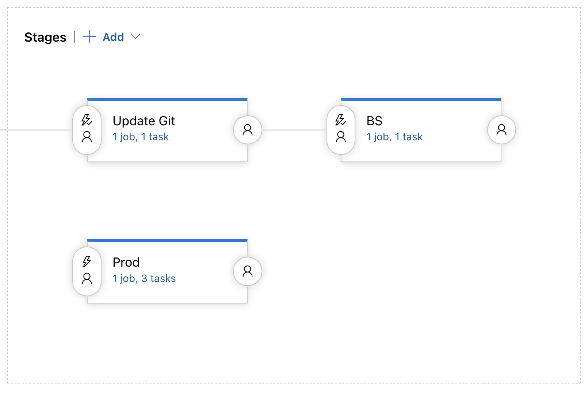
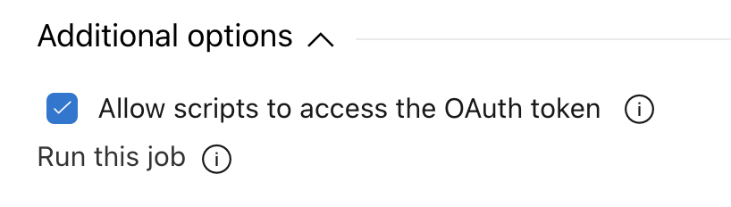
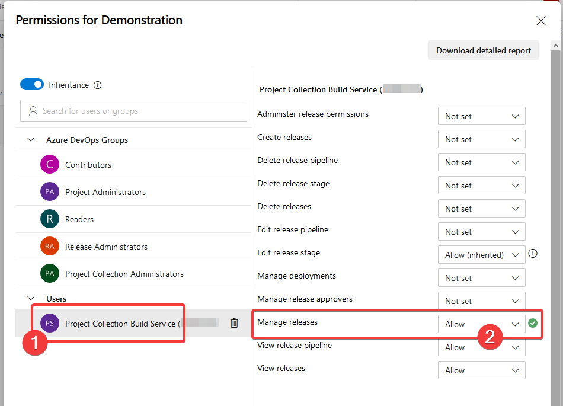

# Azure Devops for APIM
### A set of scripts to use in Azure DevOps for Azure Api Management CI/CD

remember to use apim named values to differentiate the endpoints or other variables between the PRE, BS and PROD environments.

The following variables should be created in the release pipeline and two of them should be enabled as settable variables at release time:

- ReleaseCommit ✅ 
- RollBackCommit ✅    
- ResourceGroupPre
- ResourceGroupBS
- ResourceGroupProd
- ServiceNamePre  
- ServiceNameBS
- ServiceNameProd

Allow scripts to access the OAuth token should be activated in the agents

And change the permissions of Project Collection Build Service to Allow - Manage releases:

So at the end, the first stage will get the current status of the APIM-PRE and update the Devops Repo, the second stage get the Devops Repo and updates the APIM-BS and the last one get the Devops Repo and updates the APIM-PROD.

